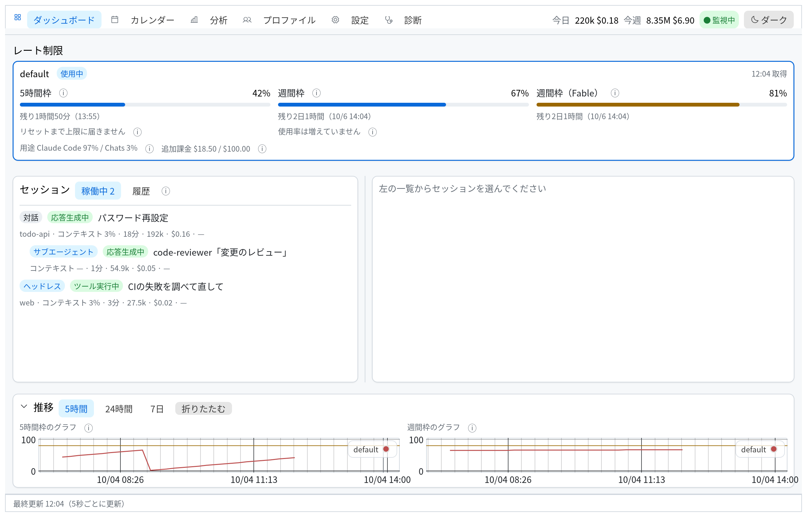
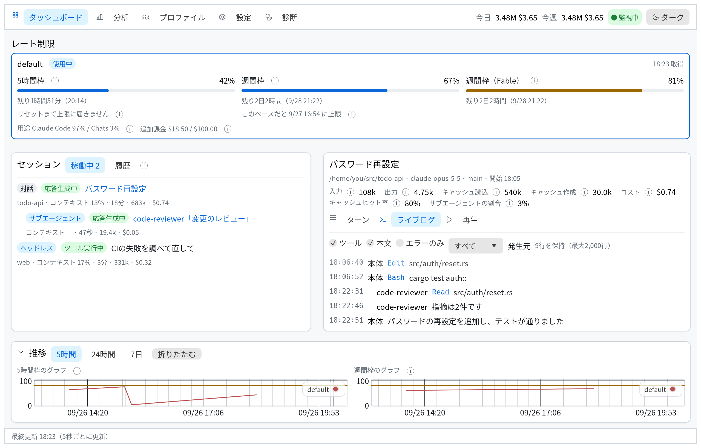
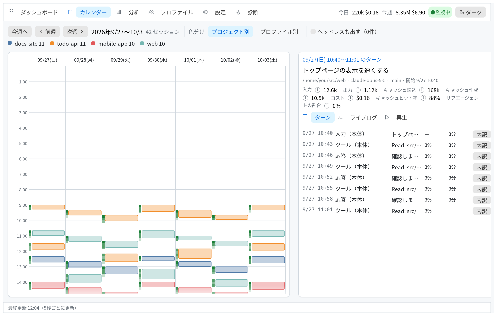
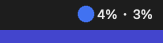

# Claude Usage Monitor

Claude CodeのToken使用量、レート制限、セッションの動きを、バックグラウンドで動くエージェントも含めて常駐監視するデスクトップアプリです。複数アカウント（プロファイル）の切り替えにも対応しています。







## 特徴

- ダッシュボードの1画面で、使用率のカード、稼働中のセッション、選んだセッションの詳細、使用率の推移をまとめて確認できます。
- 使用率のカードには、5時間枠、週間枠、モデル別の週間枠を並べます。それぞれにリセットまでの残り時間と、今のペースで上限に届く時刻の予測を出します。
- 稼働中の一覧は、画面で操作中の対話セッションのほか、SDKや`claude -p`によるヘッドレス実行、バックグラウンドジョブ、サブエージェントも種類別に表示します。
- セッションを選ぶと、本体とサブエージェントのツール実行を時刻順に流すライブログ、ターンごとのToken内訳、ターンを順にたどる再生を切り替えて見られます。
- 分析タブでは、プロジェクト別、モデル別、ブランチ別の使用量、キャッシュヒット率、ツールごとのエラー率を集計します。
- カレンダータブでは、全プロジェクトのセッションを日曜始まりの週間カレンダーに帯で並べます。同じ時刻に動いていたセッションは横に並び、色はプロジェクト別かプロファイル別で分けられます。帯を押すと、右にそのセッションの概要が出ます。ヘッドレス実行は既定で隠し、切り替えで表示できます。
- セッションの概要では、Claude Codeが書いた作業の要約、期間と作業時間、依頼とAPI要求とツール呼び出しの回数、モデル別とツール別の集計、依頼の一覧を確かめられます。
- 使用率が設定した閾値を超えると、OSの通知で1回だけ知らせます。余裕のある別のプロファイルがあれば、切り替えのコマンドも通知に添えます。
- 稼働中のセッションとClaude Desktopのメモリ使用量を表示します。行の「プロセスを終了」ボタンか、Desktopのカードのボタンを押すと、確認を経てプロセスに終了を要求し、メモリをOSに返せます。サブエージェントは親のプロセスの中で動くため、1体だけを終了することはできません。
- メニューバーに使用中のプロファイルの使用率を表示し、画面の起動、プロファイルの切り替え、一時停止をメニューから行えます。
- 各指標名の横の「ⓘ」にマウスを載せると、その指標の意味を表示します。
- ライトとダークの配色を切り替えられ、ウィンドウの大きさを変えると各部品が追随して伸縮します。

## 対応OS

対応OSはmacOS、Windows、Linuxです。認証情報は、Claude Codeの[認証のドキュメント](https://code.claude.com/docs/en/iam)に書かれた場所から読み出します。読み出し先は、macOSではKeychain、WindowsとLinuxでは設定ディレクトリの`.credentials.json`です。

## インストール

Rust 1.98以上が必要です。リポジトリを取得してから、次のコマンドで`cumon`コマンドを入れます。

```bash
cargo install --path .
```

macOSで、ログイン時の自動起動を有効にしたまま入れ直す場合は、次の順に実行します。デーモンを登録したままバイナリを入れ替えて再起動すると、macOSが入れ替え後の最初の起動を署名の検査で止めます。インストールの前にlaunchdから外し、インストールの後に登録し直してください。

```bash
launchctl bootout gui/$(id -u)/claude-usage-monitor
cargo install --path .
launchctl bootstrap gui/$(id -u) ~/Library/LaunchAgents/claude-usage-monitor.plist
```

## 使い方

常駐デーモンを起動すると、使用量の取得とセッションの記録を始めます。

```bash
cumon daemon
```

デーモンは、メニューバーに使用中のプロファイルの使用率を「5時間枠 · 週間枠」の形で表示します。



画面はデーモンとは別のプロセスで開きます。閉じるとプロセスごと終わるので、描画に使ったメモリはOSに返ります。

```bash
cumon gui
```

メニューバーを使わない環境では、`cumon daemon --no-tray`で起動します。ログイン時に自動で起動したい場合は、設定タブの「ログイン時にデーモンを起動する」を有効にしてください。

### デーモンをターミナルから切り離して動かす

ターミナルで`cumon daemon`を実行すると、デーモンはそのターミナルの中で動きます。ターミナルを閉じた後も動かし続けたい場合は、次のいずれかの方法で起動してください。

ログイン時の自動起動を有効にすると、launchdが`claude-usage-monitor`という名前でデーモンを管理します。この場合、ターミナルを閉じてもデーモンは止まらず、ログインし直したときも自動で起動します。トレイの「終了」で止めたデーモンは終了コード0で終わるので、launchdは起動し直しません。もう一度動かすときは、次のコマンドを実行します。

```bash
launchctl kickstart gui/$(id -u)/claude-usage-monitor
```

自動起動を使わずにターミナルから切り離すには、`nohup`で起動します。

```bash
nohup cumon daemon >/dev/null 2>&1 &
```

GUIからも起動できます。デーモンが動いていないとき、画面の上部に「デーモンを起動」のボタンが出るので、これを押してください。

### プロファイルの切り替え

プロファイルの実体は、Claude Codeの設定ディレクトリ（`CLAUDE_CONFIG_DIR`）です。`cumon run`は、使用中のプロファイルの設定ディレクトリを指定して`claude`を起動します。普段の`claude`をこれに置き換えるには、シェルに次の別名を登録してください。

```bash
alias claude='cumon run'
```

プロファイルの管理には、次のコマンドを使います。

```bash
cumon profile list
cumon profile add work              # 設定ディレクトリは ~/.claude-work
cumon profile add work --config-dir ~/claude-work
cumon profile use work
cumon profile remove work
```

追加したプロファイルは、`cumon profile use`で使用中にしてから`cumon run`を実行し、Claude Codeの`/login`でログインすると使えます。プロファイルタブとダッシュボードのカードからも、同じ操作を行えます。

## データの場所と保持期間

記録は、macOSでは`~/Library/Application Support/work.okamyuji.cumon/cumon.db`に、ほかのOSではそれぞれのアプリ用データディレクトリにSQLiteで保存します。保持期間の既定は90日で、設定タブで変更が可能です。要約や題名を持たない古い版の記録を開いた場合は、次の全体走査で保持期間内のJSONLをすべて読み直します。この読み直しで、過去の要約と題名も取り込まれます。アクセストークンは保存しません。使用量の取得のたびに、Claude Codeが保存した認証情報を読み出して使います。

## 制限事項

- 概要の要約は、Claude Codeが離席中に書いた要約（JSONLの`away_summary`の行）を表示したものです。Claude Codeがこの要約を書くのは、[端末を3分以上離れたとき](https://code.claude.com/docs/en/interactive-mode.md#session-recap)に限られます。要約のないセッションでは、Claude Codeが最初の依頼から付けた題名（JSONLの`ai-title`の行）を代わりに出します。作業の流れは依頼の一覧で確かめてください。
- 要約と題名はJSONLから取り込みます。Claude Codeは既定で30日より古いJSONLを消すので、取り込む前に消えたセッションの要約と題名は読めません。
- 推論の強さ（effort）、追加と削除の行数、APIエラーの数は、JSONLから取り込んでいないため表示しません。
- 作業時間は、ターンの間が15分を超えて空いた時間を除いて数えます。カレンダーの帯の長さと同じ基準です。
- 依頼の一覧と回数には、バックグラウンド処理の通知、コマンドの出力、中断の通知など、利用者の入力として記録された機械の出力を含めません。スラッシュコマンドは、`/effort high`のように名前と引数で表示します。
- 依頼は1件あたり200字までを保存します。それより長い依頼は、一覧で途中までを表示します。

## メモリ使用量

常駐させて使うことを前提に、メモリを抑える作りにしています。macOSで測った物理フットプリント（アクティビティモニタの「メモリ」と同じ値）は次のとおりです。

| 状態 | 物理フットプリント |
|---|---|
| デーモン（トレイなし、起動後20〜120秒） | 21MB |
| デーモン（トレイなし、数時間の稼働後） | 11MB |
| デーモン（トレイあり、起動後20〜120秒） | 41MB |
| 画面（実データを表示した状態） | 184MB |

トレイを出すと、メニューバーのためにmacOSのAppKitが約20MBを確保します。画面の値のうち約106MBは、GPUドライバが描画のために確保する分です。画面はOpenGLで描画しています。同じ画面をwgpuで描いた場合は約253MBで、これより約60MB多くかかりました。日本語フォントはアプリに埋め込んで複製せずに使っています。

## 開発

テストは`cargo test`で実行します。一部のテストは、使用量APIの代わりにWireMockをDockerのコンテナで起動します。Colimaを使う場合は、次の環境変数を設定してください。

```bash
export DOCKER_HOST=unix://$HOME/.colima/default/docker.sock
export TESTCONTAINERS_DOCKER_SOCKET_OVERRIDE=/var/run/docker.sock
```

変更したファイルの品質は`scripts/gate.sh`で確かめられます。このスクリプトは、フォーマット、clippy、行カバレッジ（80%以上）、CRAP値（15未満）、mutation testing（生存0件）を順に検査します。mutation testingの対象は、`GATE_BASE`（既定は`HEAD`）から変わった行だけです。mutation testingは数十分かかるので、`GATE_NO_MUTANTS=1`を付けると省略できます。`GATE_LOW=1`を付けると、ビルドとテストを1本ずつ、macOSのバックグラウンドの優先度で動かします。時間はかかりますが、マシンが重くなりません。このときmutation testingは作業ツリーをその場で書き換えるので、終わるまでソースを編集しないでください。

```bash
scripts/gate.sh src/controllers/gui/app.rs
GATE_BASE=origin/main scripts/gate.sh src/controllers/gui/app.rs
GATE_LOW=1 scripts/gate.sh src/controllers/gui/app.rs
```

長時間の稼働でメモリが増え続けないことは、デーモンを1,000周期回すリーク検査で確かめます。100周期目と1,000周期目のRSSを比べ、5MBを超えて増えていれば失敗にします。macOSで測った値は、トレイなしで12.0MBから11.6MB、トレイありで73.4MBから29.0MBでした。所要時間は約17分なので、通常のテストとは分けて実行します。

```bash
cargo test --release --test leak -- --ignored --nocapture
```

READMEの画像は、架空のデータから作り直します。`examples/demo_data.rs`がClaude Codeと同じ形のログを一時的なHOMEに書き、デーモンと同じ取り込み処理でDBに入れます。稼働中かどうかは最終更新からの経過時間で決まるため、データを作ったらすぐに画像を書き出してください。

```bash
cargo run --example demo_data -- /tmp/cumon-demo/data /tmp/cumon-demo/home
CUMON_DEMO_DATA=/tmp/cumon-demo/data CUMON_DEMO_HOME=/tmp/cumon-demo/home cargo test --test readme_images -- --ignored
```

## ライセンス

[MIT License](LICENSE)で公開しています。同梱の日本語フォント[Noto Sans JP](https://github.com/notofonts/noto-cjk)はSIL Open Font License 1.1で配布されており、ライセンス文書は[assets/fonts/OFL.txt](assets/fonts/OFL.txt)にあります。
